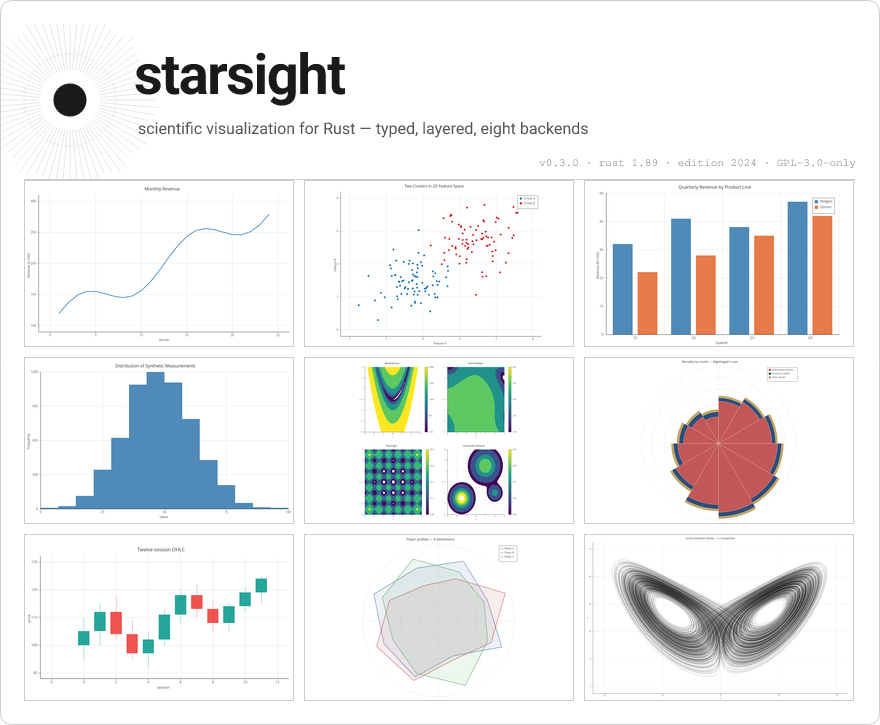
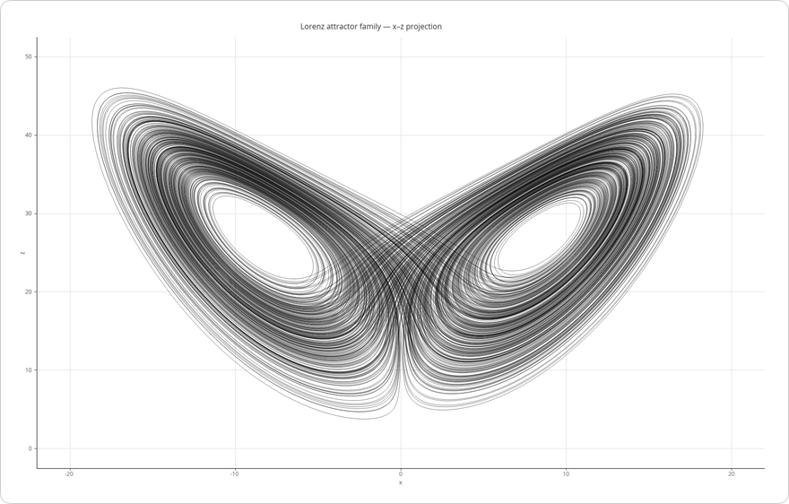
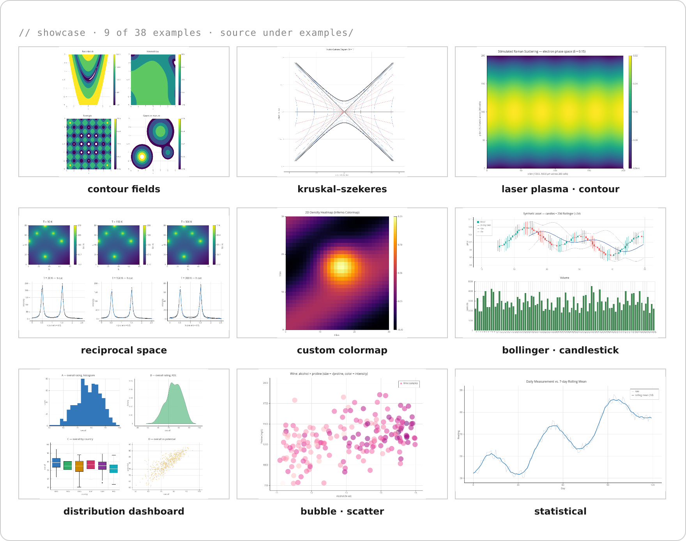

<!--
  starsight — README.md
  Renders on GitHub, crates.io (Comrak + Ammonia), docs.rs, lib.rs.
  Constraints respected:
    - <details>/<summary>, GFM tables, GitHub alerts (> [!NOTE]) all survive
      Ammonia sanitization.
    - No inline <svg>, no <style>, no Mermaid, no class/id hooks.
    - LaTeX $$...$$ renders on GitHub; degrades to readable source on crates.io.
  PREVIEW MODE: image and link paths are relative (`assets/...`, `./examples/...`)
  for inspection on the development branch. A pre-publish hook (or sed-style
  rewrite) flips them to absolute https://raw.githubusercontent.com/.../main/...
  before crates.io publish — relative paths don't resolve on crates.io
  (rust-lang/crates.io issue #982).
  Each chrome asset has paired light + dark variants under `assets/...-{light,dark}.{svg,png}`,
  selected via <picture> + prefers-color-scheme (works on GitHub since 2022 and on
  crates.io since the July 2024 update).
-->

<picture>
  <source media="(prefers-color-scheme: dark)" srcset="assets/hero/starsight-hero-dark.png">
  
</picture>

# starsight

*a typed, layered figure compiler for Rust — from zero-config one-liners to GPU-accelerated 3D, eight backends, no global state.*

starsight turns a `Figure` of marks (line, scatter, bar, area, histogram, heatmap, box-plot, violin, KDE, pie, contour, candlestick, polar arc, radar, error bars, …) into pixel-perfect output through a tiny-skia or SVG backend, with PDF, terminal, and GPU paths arriving on the [roadmap](#roadmap). It is designed for the moments when a paper, a notebook, and a service need to render the same chart.

<picture>
  <source media="(prefers-color-scheme: dark)" srcset="assets/status/panel-dark.svg">
  
</picture>

> [!WARNING]
> **starsight is at 0.3.0 of a planned 1.0.0 trajectory.** The roadmap below is the contract — items marked **shipped** are stable within the 0.x line; items marked **planned** may shift in scope. Pre-1.0, every minor bump is potentially breaking. MSRV bumps require a minor version bump until 1.0.

---

## thirty seconds

```toml
[dependencies]
starsight = "0.3"
```

```rust
use starsight::prelude::*;

fn main() -> starsight::Result<()> {
    plot!(&[1.0, 2.0, 3.0, 4.0], &[10.0, 20.0, 15.0, 25.0]).save("chart.png")
}
```

The `plot!` macro forwards through `Figure::from_arrays`, which builds an 800×600 figure with a single `LineMark` and dispatches to the tiny-skia backend by file extension. There is no global state, no implicit theme, no runtime config — every figure is a value. See [`examples/`](./examples) for 38 self-contained programs.

## install

The `default` feature ships a usable starting set: `LineMark`, `PointMark`, `BarMark`, `AreaMark`, `HistogramMark`, `HeatmapMark`, `BoxPlotMark`, `ViolinMark`, `PieMark`, `ContourMark`, `CandlestickMark`, polar marks (`ArcMark`, `PolarBarMark`, `PolarRectMark`, `RadarMark`), the tiny-skia raster backend, the SVG backend, and Wilkinson tick generation. Feature flags toggle the rest:

| flag | what it adds |
|---|---|
| `polars` | accept `polars::DataFrame` columns directly |
| `ndarray` | accept `ndarray::ArrayN` views (planned 0.11) |
| `arrow` | accept `arrow::RecordBatch` (planned 0.11) |
| `gpu` | wgpu + vello GPU rendering (planned 0.6) |
| `interactive` | winit + egui interactive windows (planned 0.6) |
| `terminal` | TUI via ratatui — Kitty / Sixel / iTerm2 / half-block / Braille (planned 0.8) |
| `pdf` | PDF export via krilla (planned 0.10) |
| `web` | WASM + WebGPU browser target (planned 0.10) |
| `3d` | 3D chart types via nalgebra (planned 0.9) |

`full` enables everything; `minimal` is core types only with no rendering. The `science` and `dashboard` bundles compose related flag sets.

## architecture

<picture>
  <source media="(prefers-color-scheme: dark)" srcset="assets/architecture-dark.svg">
  
</picture>

A pipeline of three stages — **compose**, **resolve**, **render**:

1. **compose** — you build a `Figure` and add marks. Marks own their data references and their style.
2. **resolve** — starsight computes scales, ticks, layout, and a flat list of geometric primitives. This stage is pure; it does not touch I/O.
3. **render** — a backend walks the primitives and writes output.

The facade crate (`starsight`) is the only crate users add to `Cargo.toml`. It exposes three access patterns so users can pick the one that fits their style:

- **Prelude:** `use starsight::prelude::*;` for the common types.
- **Semantic modules:** `use starsight::marks::LineMark;`, `use starsight::backends::SkiaBackend;` — by category.
- **Latin layer aliases:** `use starsight::components::marks::LineMark;` — by layer.

<details>
<summary><b>Why three stages and seven layers?</b></summary>

Separating compose from render lets the same `Figure` produce a PNG for a notebook, an SVG for a paper, and a `Vec<u8>` for an HTTP response without re-stating intent. Separating resolve from compose lets us cache layout when only style changes — which is most of the time, in interactive contexts.

The seven layers exist to encode a one-way dependency rule: marks (L3) cannot reach into figures (L5), and figures cannot reach into export (L7). This makes the library refactor-friendly: adding a new mark type touches one layer; adding a new backend touches two; adding a new statistical transform touches one. The rule is enforced at workspace `Cargo.toml` level, not by convention — try to add an upward dependency and `cargo check` rejects it.

</details>

## a worked example — the Lorenz attractor

starsight is a viz library; the math is what it draws. The Lorenz system

$$
\dot{x} = \sigma (y - x), \qquad
\dot{y} = x (\rho - z) - y, \qquad
\dot{z} = x y - \beta z
$$

with $\sigma = 10$, $\beta = 8/3$, $\rho = 28$ is the textbook strange attractor. Eleven trajectories sweeping $\rho \in \{13, 15, 18, 21, 24.06, 28, 35, 50, 100, 160, 250\}$, integrated with RK4 at $\mathrm{d}t = 0.005$ for 80 000 steps and projected onto the $x$–$z$ plane:

<details>
<summary><b>Rust integration loop (RK4)</b></summary>

```rust
use starsight::prelude::*;

#[derive(Clone, Copy)]
struct State { x: f64, y: f64, z: f64 }

fn deriv(s: State, sigma: f64, rho: f64, beta: f64) -> State {
    State {
        x: sigma * (s.y - s.x),
        y: s.x * (rho - s.z) - s.y,
        z: s.x * s.y - beta * s.z,
    }
}

fn integrate(rho: f64) -> (Vec<f64>, Vec<f64>) {
    let (sigma, beta, dt) = (10.0_f64, 8.0_f64 / 3.0, 0.005_f64);
    let mut s = State { x: 1.0, y: 1.0, z: 1.0 };
    let mut xs = Vec::with_capacity(75_000);
    let mut zs = Vec::with_capacity(75_000);
    for step in 0..80_000 {
        // RK4 — see examples/scientific/lorenz_line.rs for full implementation
        s = rk4_step(s, dt, sigma, rho, beta);
        if step >= 5_000 {        // discard transient
            xs.push(s.x);
            zs.push(s.z);
        }
    }
    (xs, zs)
}

fn main() -> starsight::Result<()> {
    let (xs, zs) = integrate(28.0);
    Figure::new(1000, 700)
        .title("Lorenz attractor (σ=10, β=8/3, ρ=28)")
        .add(LineMark::new(xs, zs).width(0.6))
        .save("lorenz.png")
}
```

</details>

Real source: [`examples/scientific/lorenz_line.rs`](./examples/scientific/lorenz_line.rs) (the eleven-trajectory sweep, coloured by $\rho$ on prismatica's inferno map). A second worked example — the Kruskal–Szekeres coordinate chart for the Schwarzschild metric — lives at [`examples/scientific/kruskal_szekeres_line.rs`](./examples/scientific/kruskal_szekeres_line.rs).

<picture>
  <source media="(prefers-color-scheme: dark)" srcset="assets/lorenz-dark.png">
  
</picture>

## showcase

<picture>
  <source media="(prefers-color-scheme: dark)" srcset="assets/gallery-dark.png">
  
</picture>

Source for every panel — and 29 more — lives under [`examples/`](./examples), regenerated by `cargo xtask gallery`.

## what works at 0.3.0

| capability | available | added in |
|---|---|---|
| `LineMark`, `PointMark`, `Figure`, `plot!`, SVG + tiny-skia backends, Wilkinson ticks | ✓ | 0.1 |
| `BarMark` (vertical / horizontal / grouped / stacked), `AreaMark` (NaN-gap), `HistogramMark`, `HeatmapMark` | ✓ | 0.2 |
| `BoxPlotMark`, `ViolinMark` + `Kde`, `PieMark` / donut, `CandlestickMark` | ✓ | 0.3 |
| `PolarCoord`, `ArcMark` (Nightingale, Gauge, Sunburst), `PolarBarMark` (wind rose), `PolarRectMark` (polar calendar), `RadarMark` (spider) | ✓ | 0.3 |
| `ContourMark` + marching-squares, `ErrorBarMark`, `RugMark`, auto-attached `Colorbar`, `MultiPanelFigure` | ✓ | 0.3 |
| Polars `DataFrame` integration | ✓ (`polars` feature) | 0.3 |
| `LogScale`, `SqrtScale`, `CategoricalScale` | ✓ | 0.3 |
| `FacetWrap`, shared axes across panels, polar-aware legend placement, contour filled bands | planned | 0.4 |
| `SymLogScale`, `DateTimeScale`, `BandScale` | planned | 0.5 |
| GPU + interactivity (wgpu, hover / zoom / pan) | planned | 0.6 |
| Animation, GIF, frame recording | planned | 0.7 |
| Terminal backend (Kitty / Sixel / iTerm2 / half-block / Braille) | planned | 0.8 |
| 3D marks (`Surface3D`, `Scatter3D`, isosurface) | planned | 0.9 |
| PDF (krilla), interactive HTML, WebGPU | planned | 0.10 |
| ndarray / Arrow data acceptance | planned | 0.11 |

## backends

| backend | output | dependencies | feature flag | status |
|---|---|---|---|---|
| `SkiaBackend` | `.png` / `.jpeg` / raw RGBA | tiny-skia | default | stable |
| `SvgBackend` | `.svg` text | none | default | stable |
| `WgpuBackend` | GPU surface, headless or windowed | wgpu, vello | `gpu` | planned 0.6 |
| `RatatuiBackend` | TUI cells (Kitty / Sixel / iTerm2 / half-block / Braille) | ratatui | `terminal` | planned 0.8 |
| `KrillaBackend` | `.pdf` | krilla | `pdf` | planned 0.10 |
| `WasmBackend` | `<canvas>` in browser | wasm-bindgen, web-sys | `web` | planned 0.10 |

The `DrawBackend` trait is the only interface marks need to render; new backends slot in by implementing it — no other layer needs to change.

## ecosystem

starsight composes with, but does not depend on:

- **`polars`** / **`ndarray`** / **`arrow`** — feed columns into mark constructors via `From<&[T]>`; `polars` is wired today, `ndarray` and `arrow` arrive in 0.11.
- **`time`** / **`chrono`** — `DateTimeScale` will consume either (planned 0.5).
- **`serde`** — every mark and theme implements `Serialize` / `Deserialize` for spec-as-data workflows.
- **`ratatui`** — the planned `RatatuiBackend` renders into TUI cells (planned 0.8).

It is part of the [resonant-jovian](https://github.com/resonant-jovian) ecosystem of Latin/Greek-named scientific Rust crates: [`chromata`](https://github.com/resonant-jovian/chromata) (1 104 editor / terminal color themes as compile-time constants), [`prismatica`](https://github.com/resonant-jovian/prismatica) (260+ perceptually uniform colormaps as compile-time LUTs), [`caustic`](https://github.com/resonant-jovian/caustic) (6D Vlasov–Poisson plasma solver), [`phasma`](https://github.com/resonant-jovian/phasma) (terminal UI for `caustic`).

## coming from another language

| you wrote | in starsight | note |
|---|---|---|
| `plt.plot(x, y)` (matplotlib) | `Figure::new(800, 600).add(LineMark::new(x, y))` | no global state |
| `plt.scatter(x, y, c=c)` | `PointMark::new(x, y).color_by(&groups)` | builder pattern |
| `plt.bar(labels, vals)` | `BarMark::new(categories, values)` | grammar of graphics |
| `plt.boxplot([a, b])` | `BoxPlotMark::new(vec![BoxPlotGroup::new("a", a), …])` | per-group label travels with the data |
| `sns.violinplot(data=df, x=…, y=…)` | `ViolinMark::new(groups).bandwidth(Bandwidth::Silverman)` | bandwidth strategy is a builder, not magic |
| `plt.pie(values, labels=…)` | `PieMark::new(values, labels).show_percent()` | add `.inner_radius(0.5)` for a donut |
| `mpl_finance.candlestick_ohlc` | `CandlestickMark::new(vec![Ohlc { … }, …])` | inline `Ohlc` rows; no helper crate |
| `plt.savefig("out.png")` | `.save("out.png")?` | returns `Result` |
| `plt.show()` | `.show()?` | feature `interactive` |
| `sns.heatmap(data)` | `HeatmapMark::new(data)` | prismatica colormaps |
| `ggplot + geom_point()` | `Figure::new(W, H).add(PointMark::new(x, y))` | builder, not `+` |
| `px.scatter(df, x="a")` (plotly) | `plot!(df, x="a", y="b")` | feature `polars` |

## vs siblings

| project | strengths | when to prefer starsight |
|---|---|---|
| **plotters** | mature, many backends, WASM-ready | want typed marks; want to compose figures rather than imperatively draw |
| **plotly-rs** | interactive HTML out of the box | want static SVG/PNG; do not want a JS runtime |
| **charming** | ECharts-quality visuals | do not want to ship a JS engine (deno_core) at runtime |
| **plotters-iced / egui_plot** | live in a GUI | want headless rendering as the primary path |
| **poloto** | small, no_std-friendly, terminal-first | want a richer mark set (polar, contour, candlestick) and academic publication output |

The bet behind starsight: **one crate** covering CPU + GPU + terminal + PDF with a grammar-of-graphics builder and shared themes/colormaps via `chromata` + `prismatica`. All siblings are alive and growing — these comparisons are "as of starsight 0.3" and the gaps narrow as each ships.

## roadmap

<picture>
  <source media="(prefers-color-scheme: dark)" srcset="assets/roadmap-dark.svg">
  
</picture>

- [x] **0.1** Foundation — `DrawBackend`, tiny-skia + SVG, `LinearScale`, Wilkinson ticks, axes, `LineMark` / `PointMark`, `Figure`, `plot!`, snapshots
- [x] **0.2** Core charts — `BarMark` (vertical/horizontal/grouped/stacked), `AreaMark` (NaN-gap), `HistogramMark`, `HeatmapMark`
- [x] **0.3** Statistical + polar + contour + grid + Polars — `BoxPlotMark`, `ViolinMark` + `Kde`, `PieMark`/donut, `CandlestickMark`, polar suite (`PolarCoord`, `ArcMark`, `PolarBarMark`, `PolarRectMark`, `RadarMark`), `ContourMark` + marching-squares, `ErrorBarMark`, `RugMark`, auto-attached `Colorbar`, `MultiPanelFigure`, Polars `DataFrame` integration
- [ ] **0.4** Layout — `FacetWrap`, shared axes across panels, polar-aware legend placement, contour filled bands
- [ ] **0.5** Scale infrastructure — `SymLogScale`, `DateTimeScale`, `BandScale`
- [ ] **0.6** GPU + interactivity — wgpu native, hover / zoom / pan, winit event loop
- [ ] **0.7** Animation — timeline, frame recording, GIF
- [ ] **0.8** Terminal — Kitty / Sixel / iTerm2 / half-block / Braille
- [ ] **0.9** 3D — `Surface3D`, `Scatter3D`, isosurface
- [ ] **0.10** Export + WASM — PDF (krilla), interactive HTML, WebGPU
- [ ] **0.11** Data acceptance — ndarray / Arrow
- [ ] **0.12** Documentation, examples, gallery polish
- [ ] **1.0** Stable release — semver guarantees freeze

The full task-level roadmap with 338 checkboxes lives in [`.spec/STARSIGHT.md`](./.spec/STARSIGHT.md).

## minimum supported rust version

starsight 0.3.x compiles on **Rust 1.89** and later, edition 2024. The MSRV tracks the floor required by direct dependencies (currently `cosmic-text` at 1.89). The long-term policy is *latest stable minus two*, consistent with `wgpu` and `ratatui`. **MSRV bumps require a minor version bump until 1.0.**

## contributing

Contribution guide: [`CONTRIBUTING.md`](./CONTRIBUTING.md). The workspace conventions (layered architecture, error policy, snapshot tests) are documented in [`AGENTS.md`](./AGENTS.md). Issues and discussion: [github.com/resonant-jovian/starsight/issues](https://github.com/resonant-jovian/starsight/issues).

## license

starsight is licensed under **GPL-3.0-only**. See [`LICENSE`](./LICENSE). Any project that links against it must be GPL-3.0-compatible — copyleft propagates through derivative works. If the GPL is incompatible with your use case, [reach out](mailto:albin@sjoegren.se) — a permissively-licensed core may be carved out post-1.0.

## funding

starsight is built by [Albin Sjögren](https://github.com/resonant-jovian) ([ORCID 0009-0008-1372-1727](https://orcid.org/0009-0008-1372-1727)) as a solo open-source project. If your work depends on it, consider funding development so the next milestone lands sooner: [github sponsors](https://github.com/sponsors/resonant-jovian) · [thanks.dev](https://thanks.dev/u/gh/resonant-jovian).

## citing

[`CITATION.cff`](./CITATION.cff) is the canonical source — GitHub renders a "Cite this repository" button from it automatically. The BibTeX block below is the manual fallback:

```bibtex
@software{starsight,
  author  = {Sj{\"o}gren, Albin},
  title   = {starsight: a typed, layered figure compiler for Rust},
  url     = {https://github.com/resonant-jovian/starsight},
  version = {0.3.0},
  year    = {2026},
  license = {GPL-3.0-only},
  orcid   = {0009-0008-1372-1727}
}
```

---

<picture>
  <source media="(prefers-color-scheme: dark)" srcset="assets/social/card-dark.png">
  
</picture>
