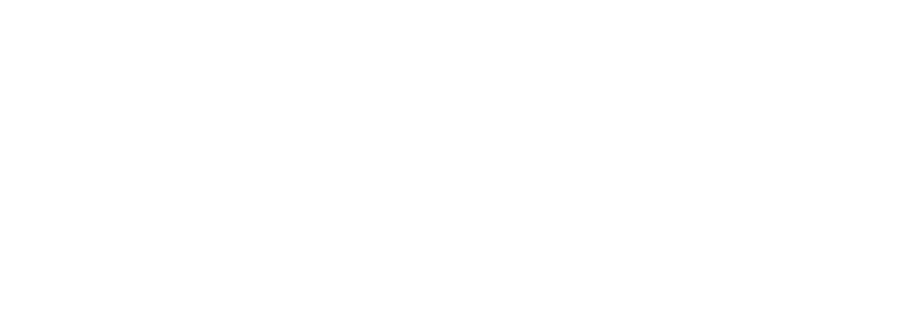
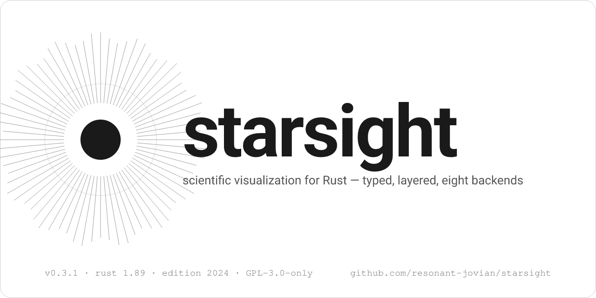

<!--
  TEMPORARY: relative paths for local preview only.
  Revert to absolute URLs (https://raw.githubusercontent.com/.../main/...) before
  `cargo publish` — relative paths do not resolve on crates.io
  (rust-lang/crates.io issue #982).
  Hero / gallery / lorenz are SVG; social card is PNG (OG/Twitter/Slack unfurls
  only render raster meta-images).
-->

<picture>
  <source media="(prefers-color-scheme: dark)" srcset="assets/hero/starsight-hero-dark.svg">
  
</picture>

# starsight

*a typed, layered figure compiler for Rust — from zero-config one-liners to GPU-accelerated 3D, eight backends, no global state.*

starsight turns a `Figure` of marks (line, scatter, bar, area, histogram, heatmap, box-plot, violin, KDE, pie, contour, candlestick, polar arc, radar, error bars, …) into pixel-perfect output through a tiny-skia or SVG backend, with PDF, terminal, and GPU paths arriving on the [roadmap](#roadmap). It is designed for the moments when a paper, a notebook, and a service need to render the same chart.

<picture>
  <source media="(prefers-color-scheme: dark)" srcset="assets/status/panel-dark.svg">
  
</picture>

<p><a href="https://crates.io/crates/starsight"><picture><source media="(prefers-color-scheme: dark)" srcset="assets/buttons/crates-dark.svg"></picture></a><a href="https://docs.rs/starsight"><picture><source media="(prefers-color-scheme: dark)" srcset="assets/buttons/docs-dark.svg"></picture></a><a href="https://app.codecov.io/gh/resonant-jovian/starsight"><picture><source media="(prefers-color-scheme: dark)" srcset="assets/buttons/codecov-dark.svg"></picture></a><a href="https://github.com/resonant-jovian/starsight/actions/workflows/ci.yml"><picture><source media="(prefers-color-scheme: dark)" srcset="assets/buttons/ci-dark.svg"></picture></a><a href="LICENSE"><picture><source media="(prefers-color-scheme: dark)" srcset="assets/buttons/license-dark.svg"></picture></a></p>

> [!WARNING]
> **starsight is at 0.3.0 of a planned 1.0.0 trajectory.** The roadmap below is the contract — items marked **shipped** are stable within the 0.x line; items marked **planned** may shift in scope. Pre-1.0, every minor bump is potentially breaking. MSRV bumps require a minor version bump until 1.0.

---

## Thirty Seconds

```toml
[dependencies]
starsight = "0.3"
```

```rust
use starsight::prelude::*;

fn main() -> starsight::Result<()> {
    plot!(&[1.0, 2.0, 3.0, 4.0], &[10.0, 20.0, 15.0, 25.0]).save("chart.png")
}
```

The `plot!` macro forwards through `Figure::from_arrays`, which builds an 800×600 figure with a single `LineMark` and dispatches to the tiny-skia backend by file extension. There is no global state, no implicit theme, no runtime config — every figure is a value. See [`examples/`](examples) for 38 self-contained programs.

## Install

The `default` feature ships a usable starting set: `LineMark`, `PointMark`, `BarMark`, `AreaMark`, `HistogramMark`, `HeatmapMark`, `BoxPlotMark`, `ViolinMark`, `PieMark`, `ContourMark`, `CandlestickMark`, polar marks (`ArcMark`, `PolarBarMark`, `PolarRectMark`, `RadarMark`), the tiny-skia raster backend, the SVG backend, and Wilkinson tick generation. Feature flags toggle the rest:

<picture>
  <source media="(prefers-color-scheme: dark)" srcset="assets/tables/install-dark.svg">
  
</picture>

`full` enables everything; `minimal` is core types only with no rendering. The `science` and `dashboard` bundles compose related flag sets.

## Architecture

<picture>
  <source media="(prefers-color-scheme: dark)" srcset="assets/architecture-dark.svg">
  
</picture>

A pipeline of three stages — **compose**, **resolve**, **render**:

1. **compose** — you build a `Figure` and add marks. Marks own their data references and their style.
2. **resolve** — starsight computes scales, ticks, layout, and a flat list of geometric primitives. This stage is pure; it does not touch I/O.
3. **render** — a backend walks the primitives and writes output.

The facade crate (`starsight`) is the only crate users add to `Cargo.toml`. It exposes three access patterns so users can pick the one that fits their style:

- **Prelude:** `use starsight::prelude::*;` for the common types.
- **Semantic modules:** `use starsight::marks::LineMark;`, `use starsight::backends::SkiaBackend;` — by category.
- **Latin layer aliases:** `use starsight::components::marks::LineMark;` — by layer.

<details>
<summary><b>Why three stages and seven layers?</b></summary>

Separating compose from render lets the same `Figure` produce a PNG for a notebook, an SVG for a paper, and a `Vec<u8>` for an HTTP response without re-stating intent. Separating resolve from compose lets us cache layout when only style changes — which is most of the time, in interactive contexts.

The seven layers exist to encode a one-way dependency rule: marks (L3) cannot reach into figures (L5), and figures cannot reach into export (L7). This makes the library refactor-friendly: adding a new mark type touches one layer; adding a new backend touches two; adding a new statistical transform touches one. The rule is enforced at workspace `Cargo.toml` level, not by convention — try to add an upward dependency and `cargo check` rejects it.

</details>

## Pipeline

What `plot!()` actually does, stage by stage:

<picture>
  <source media="(prefers-color-scheme: dark)" srcset="assets/pipeline-dark.svg">
  
</picture>

## A Worked Example — the Lorenz Attractor

starsight is a viz library; the math is what it draws. The Lorenz system

$$
\dot{x} = \sigma (y - x), \qquad
\dot{y} = x (\rho - z) - y, \qquad
\dot{z} = x y - \beta z
$$

with $\sigma = 10$, $\beta = 8/3$, $\rho = 28$ is the textbook strange attractor. Eleven trajectories sweeping $\rho \in \{13, 15, 18, 21, 24.06, 28, 35, 50, 100, 160, 250\}$, integrated with RK4 at $\mathrm{d}t = 0.005$ for 80 000 steps and projected onto the $x$–$z$ plane:

<details>
<summary><b>Rust integration loop (RK4)</b></summary>

```rust
use starsight::prelude::*;

#[derive(Clone, Copy)]
struct State { x: f64, y: f64, z: f64 }

fn deriv(s: State, sigma: f64, rho: f64, beta: f64) -> State {
    State {
        x: sigma * (s.y - s.x),
        y: s.x * (rho - s.z) - s.y,
        z: s.x * s.y - beta * s.z,
    }
}

fn integrate(rho: f64) -> (Vec<f64>, Vec<f64>) {
    let (sigma, beta, dt) = (10.0_f64, 8.0_f64 / 3.0, 0.005_f64);
    let mut s = State { x: 1.0, y: 1.0, z: 1.0 };
    let mut xs = Vec::with_capacity(75_000);
    let mut zs = Vec::with_capacity(75_000);
    for step in 0..80_000 {
        // RK4 — see examples/scientific/lorenz_line.rs for full implementation
        s = rk4_step(s, dt, sigma, rho, beta);
        if step >= 5_000 {        // discard transient
            xs.push(s.x);
            zs.push(s.z);
        }
    }
    (xs, zs)
}

fn main() -> starsight::Result<()> {
    let (xs, zs) = integrate(28.0);
    Figure::new(1000, 700)
        .title("Lorenz attractor (σ=10, β=8/3, ρ=28)")
        .add(LineMark::new(xs, zs).width(0.6))
        .save("lorenz.png")
}
```

</details>

Real source: [`examples/scientific/lorenz_line.rs`](examples/scientific/lorenz_line.rs) (the eleven-trajectory sweep, coloured by $\rho$ on prismatica's inferno map). A second worked example — the Kruskal–Szekeres coordinate chart for the Schwarzschild metric — lives at [`examples/scientific/kruskal_szekeres_line.rs`](examples/scientific/kruskal_szekeres_line.rs).

<picture>
  <source media="(prefers-color-scheme: dark)" srcset="assets/lorenz-dark.svg">
  
</picture>

## Showcase

<picture>
  <source media="(prefers-color-scheme: dark)" srcset="assets/gallery-dark.svg">
  
</picture>

Source for every panel — and 29 more — lives under [`examples/`](examples), regenerated by `cargo xtask gallery`.

## Status

What ships now and what's planned, broken out per subsystem. Click a category to expand. (Marks open by default — that's the question most readers want answered first.)

<details open>
<summary><strong>Marks</strong> — every glyph type the library can draw</summary>

<picture>
  <source media="(prefers-color-scheme: dark)" srcset="assets/matrices/marks-dark.svg">
  
</picture>
</details>

<details>
<summary><strong>Scales</strong> — domain → range transforms + tick generation</summary>

<picture>
  <source media="(prefers-color-scheme: dark)" srcset="assets/matrices/scales-dark.svg">
  
</picture>
</details>

<details>
<summary><strong>Backends</strong> — pluggable output via the <code>DrawBackend</code> trait</summary>

<picture>
  <source media="(prefers-color-scheme: dark)" srcset="assets/matrices/backends-dark.svg">
  
</picture>

The `DrawBackend` trait is the only interface marks need to render; new backends slot in by implementing it — no other layer needs to change.
</details>

<details>
<summary><strong>Statistics</strong> — binning, KDE, summary stats</summary>

<picture>
  <source media="(prefers-color-scheme: dark)" srcset="assets/matrices/stats-dark.svg">
  
</picture>
</details>

<details>
<summary><strong>Layout & composition</strong> — figures, panels, legends, colorbars</summary>

<picture>
  <source media="(prefers-color-scheme: dark)" srcset="assets/matrices/layout-dark.svg">
  
</picture>
</details>

<details>
<summary><strong>Output formats</strong> — what you can save to disk or render to</summary>

<picture>
  <source media="(prefers-color-scheme: dark)" srcset="assets/matrices/output-dark.svg">
  
</picture>

> [!NOTE]
> **PNG vs. SVG fidelity at high category density.** The raster (PNG) backend rounds float coordinates to pixel boundaries through skia, so at >50 categories per axis (think 90 daily candles or denser) you may see ±1 px drift between bar edges and gridlines, even when the math is f64-exact. For papers, posters, or anywhere pixel-perfect alignment matters, **prefer `.save("…svg")`** — the SVG backend is float-precise and shows no drift. PNG is best for slides, dashboards, and quick local renders where the eye won't notice 1-pixel offsets at 90+ categories.

</details>

<details>
<summary><strong>Themes & colormaps</strong> — colour identity via <code>chromata</code> + <code>prismatica</code></summary>

<picture>
  <source media="(prefers-color-scheme: dark)" srcset="assets/matrices/themes-dark.svg">
  
</picture>
</details>

## Ecosystem

starsight composes with, but does not depend on:

- **`polars`** / **`ndarray`** / **`arrow`** — feed columns into mark constructors via `From<&[T]>`; `polars` is wired today, `ndarray` and `arrow` arrive in 0.11.
- **`time`** / **`chrono`** — `DateTimeScale` will consume either (planned 0.5).
- **`serde`** — every mark and theme implements `Serialize` / `Deserialize` for spec-as-data workflows.
- **`ratatui`** — the planned `RatatuiBackend` renders into TUI cells (planned 0.8).

It is part of the [resonant-jovian](https://github.com/resonant-jovian) ecosystem of Latin/Greek-named scientific Rust crates: [`chromata`](https://github.com/resonant-jovian/chromata) (1 104 editor / terminal color themes as compile-time constants), [`prismatica`](https://github.com/resonant-jovian/prismatica) (260+ perceptually uniform colormaps as compile-time LUTs), [`caustic`](https://github.com/resonant-jovian/caustic) (6D Vlasov–Poisson plasma solver), [`phasma`](https://github.com/resonant-jovian/phasma) (terminal UI for `caustic`).

Longer-form recipes and tutorials live on the [GitHub wiki](https://github.com/resonant-jovian/starsight/wiki): [Comparisons](https://github.com/resonant-jovian/starsight/wiki/Comparisons) walks through matplotlib / ggplot2 / plotters / 15+ others side-by-side, and [Tutorials](https://github.com/resonant-jovian/starsight/wiki/Tutorials) is a 25-step ladder from `Hello starsight` to implementing a custom `Mark` or `DrawBackend`.

## Coming from Another Language

61 concrete syntax mappings across 15 source libraries. Find your line, copy the right column.

<picture>
  <source media="(prefers-color-scheme: dark)" srcset="assets/coming-from-dark.svg">
  
</picture>

## vs. Siblings

<picture>
  <source media="(prefers-color-scheme: dark)" srcset="assets/comparison-dark.svg">
  
</picture>

The bet behind starsight: **one crate** covering CPU + GPU + terminal + PDF with a grammar-of-graphics builder and shared themes/colormaps via `chromata` + `prismatica`. All siblings are alive and growing — these comparisons are "as of starsight 0.3" and the gaps narrow as each ships.

## Roadmap

<picture>
  <source media="(prefers-color-scheme: dark)" srcset="assets/roadmap-dark.svg">
  
</picture>

The full task-level roadmap with 338 checkboxes lives in [`.spec/STARSIGHT.md`](.spec/STARSIGHT.md).

## Minimum Supported Rust Version

starsight 0.3.x compiles on **Rust 1.89** and later, edition 2024. The MSRV tracks the floor required by direct dependencies (currently `cosmic-text` at 1.89). The long-term policy is *latest stable minus two*, consistent with `wgpu` and `ratatui`. **MSRV bumps require a minor version bump until 1.0.**

## Contributing

Contribution guide: [`CONTRIBUTING.md`](CONTRIBUTING.md). The workspace conventions (layered architecture, error policy, snapshot tests) are documented in [`AGENTS.md`](AGENTS.md). Issues and discussion: [github.com/resonant-jovian/starsight/issues](https://github.com/resonant-jovian/starsight/issues).

## License

starsight is licensed under **GPL-3.0-only**. See [`LICENSE`](LICENSE). Any project that links against it must be GPL-3.0-compatible — copyleft propagates through derivative works. If the GPL is incompatible with your use case, [reach out](mailto:albin@sjoegren.se) — a permissively-licensed core may be carved out post-1.0.

## Funding

starsight is built by [Albin Sjögren](https://github.com/resonant-jovian) ([ORCID 0009-0008-1372-1727](https://orcid.org/0009-0008-1372-1727)) as a solo open-source project. If your work depends on it, consider funding development so the next milestone lands sooner: [github sponsors](https://github.com/sponsors/resonant-jovian) · [thanks.dev](https://thanks.dev/u/gh/resonant-jovian).

## Citing

[`CITATION.cff`](CITATION.cff) is the canonical source — GitHub renders a "Cite this repository" button from it automatically. The BibTeX block below is the manual fallback:

```bibtex
@software{starsight,
  author  = {Sjögren, Albin},
  title   = {starsight: a typed, layered figure compiler for Rust},
  url     = {https://github.com/resonant-jovian/starsight},
  version = {0.3.0},
  year    = {2026},
  license = {GPL-3.0-only},
  orcid   = {0009-0008-1372-1727}
}
```

---

<picture>
  <source media="(prefers-color-scheme: dark)" srcset="assets/social/card-dark.png">
  
</picture>
