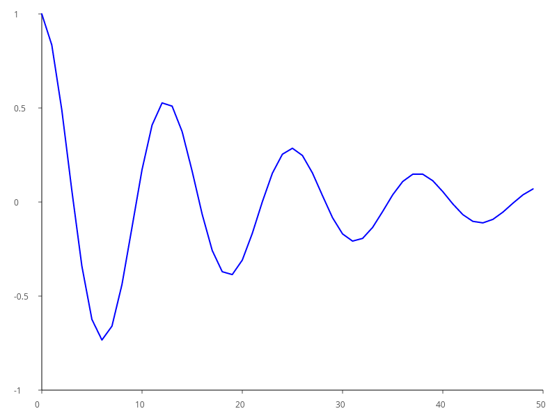
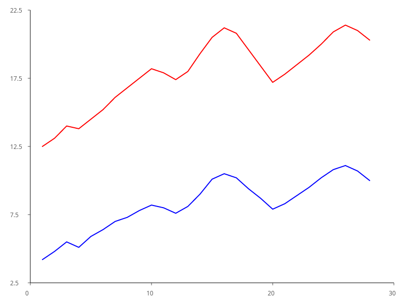
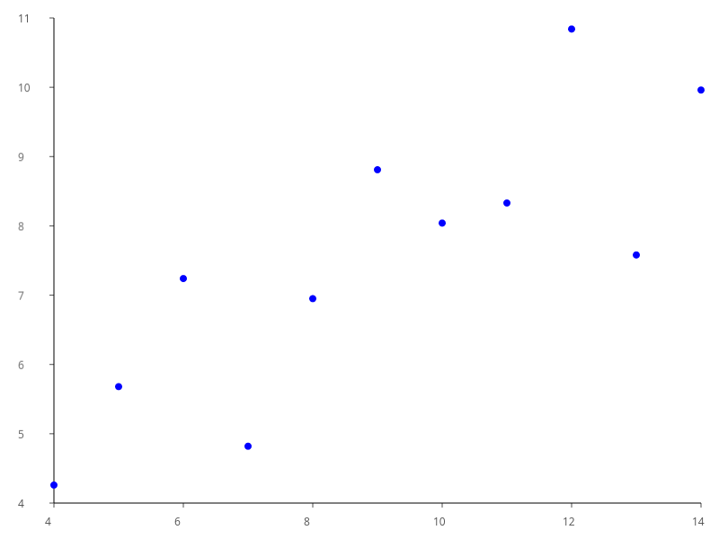

<div align="center">

<h1>starsight</h1>

**A unified scientific visualization crate for Rust — from zero-config one-liners to GPU-accelerated interactive 3D.**

[](https://github.com/sponsors/resonant-jovian)
[](https://thanks.dev/u/gh/resonant-jovian)
[](https://orcid.org/0009-0008-1372-1727)

[](https://crates.io/crates/starsight)
[](https://docs.rs/starsight)
[](https://crates.io/crates/starsight)

[](https://www.gnu.org/licenses/gpl-3.0)
[](https://releases.rs/docs/1.89.0/)
[](https://doc.rust-lang.org/edition-guide/)

[](https://github.com/resonant-jovian/starsight/actions/workflows/ci.yml)
[](https://github.com/resonant-jovian/starsight/actions/workflows/coverage.yml)
[](https://github.com/resonant-jovian/starsight/actions/workflows/gallery.yml)
[](https://github.com/resonant-jovian/starsight/actions/workflows/release.yml)
[](https://github.com/resonant-jovian/starsight/actions/workflows/snapshots.yml)

</div>

> [!CAUTION]
> **starsight** is pre-release software. The API is unstable until `1.0.0` — pin an exact version in your `Cargo.toml` if you depend on it.

---

## Quickstart

> [!TIP]
> Confused by anything in the docs? File it at [`resonant-jovian/starsight/issues`](https://github.com/resonant-jovian/starsight/issues) — every "this was unclear" report makes the next reader's life easier.

```toml
[dependencies]
starsight = "0.1"
```

```rust
use starsight::prelude::*;

fn main() -> starsight::Result<()> {
    plot!(&[1.0, 2.0, 3.0, 4.0], &[10.0, 20.0, 15.0, 25.0]).save("chart.png")
}
```

The `plot!` macro forwards through `Figure::from_arrays`, which builds an 800×600 figure with a single `LineMark` and dispatches to the tiny-skia backend by file extension. The library is organized into seven layered crates re-exported from the `starsight` facade — see [Architecture](#architecture) below.

---

## Coming from another language?

| You used | starsight | Key difference |
|---|---|---|
| `plt.plot(x, y)` | `plot!(x, y)` | No global state |
| `plt.scatter(x, y, c=c)` | `PointMark::new(x, y).color_by(&c)` | Builder pattern |
| `plt.bar(labels, vals)` | `BarMark::new(labels, vals)` | Grammar of graphics |
| `plt.savefig("out.png")` | `.save("out.png")?` | Returns `Result` |
| `plt.show()` | `.show()?` | Feature `interactive` |
| `sns.heatmap(data)` | `HeatmapMark::new(data)` | prismatica colormaps |
| `ggplot + geom_point()` | `Figure::new().add(PointMark)` | Builder, not `+` |
| `px.scatter(df, x="a")` | `plot!(df, x="a", y="b")` | Feature `polars` |

---

## Examples

<details>
<summary><b>Line chart with title and labels</b></summary>

```rust
use starsight::prelude::*;

fn main() -> starsight::Result<()> {
    Figure::new(800, 600)
        .title("Sales over time")
        .x_label("month")
        .y_label("revenue")
        .add(LineMark::new(
            vec![1.0, 2.0, 3.0, 4.0, 5.0],
            vec![3.4, 4.1, 5.7, 4.9, 6.3],
        ))
        .save("line.png")
}
```

✓ Available in 0.1.0
</details>

<details>
<summary><b>Two series with colors</b></summary>

```rust
use starsight::prelude::*;

fn main() -> starsight::Result<()> {
    Figure::new(800, 600)
        .add(
            LineMark::new(vec![0.0, 1.0, 2.0, 3.0], vec![0.0, 1.0, 2.0, 1.5])
                .color(Color::BLUE)
                .width(2.5),
        )
        .add(
            LineMark::new(vec![0.0, 1.0, 2.0, 3.0], vec![3.0, 2.0, 1.0, 0.5])
                .color(Color::RED)
                .width(2.5),
        )
        .save("two_series.png")
}
```

✓ Available in 0.1.0
</details>

<details>
<summary><b>Scatter with grouped color</b></summary>

```rust
use starsight::prelude::*;
use starsight::marks::PointMark;

fn main() -> starsight::Result<()> {
    let x = vec![1.0, 2.0, 3.0, 4.0, 5.0];
    let y = vec![2.0, 3.5, 1.8, 4.2, 3.1];
    let groups = vec!["a", "a", "b", "b", "c"];

    Figure::new(600, 400)
        .add(PointMark::new(x, y).color_by(&groups).radius(5.0))
        .save("scatter.png")
}
```

⏳ Planned in 0.2.0
</details>

<details>
<summary><b>SVG output</b></summary>

```rust
use starsight::prelude::*;

fn main() -> starsight::Result<()> {
    Figure::new(800, 600)
        .add(LineMark::new(
            vec![1.0, 2.0, 3.0, 4.0],
            vec![10.0, 20.0, 15.0, 25.0],
        ))
        .save("chart.svg") // dispatches to SvgBackend by extension
}
```

⏳ Planned in 0.2.0
</details>

<details>
<summary><b>Apply chromata theme + prismatica colormap</b></summary>

```rust
use starsight::prelude::*;
use starsight::marks::HeatmapMark;
use chromata::popular::gruvbox;
use prismatica::crameri::BATLOW;

fn main() -> starsight::Result<()> {
    let data: Vec<Vec<f64>> = (0..30)
        .map(|i| (0..30).map(|j| ((i * j) as f64).sin()).collect())
        .collect();

    Figure::new(600, 600)
        .theme(gruvbox::DARK_HARD.into())
        .add(HeatmapMark::new(data).colormap(BATLOW))
        .save("heatmap.png")
}
```

⏳ Planned in 0.3.0
</details>

### What it actually renders today

Frozen reference renders of the same data the layer-3 snapshot tests use. The full pipeline (Wilkinson ticks → axis rendering → cosmic-text labels → tiny-skia raster → PNG encoding) works end-to-end on the current code; the polished gallery wired up via `cargo xtask gallery` will land in 0.2.0.

<p align="center">
  
  
  
</p>

> Note: snapshot tests in CI use the SVG backend (deterministic across operating systems and font setups). The PNGs above are committed reference renders from a Linux box; they update when someone re-renders them locally.

---

## Architecture

```
 ┌─────────────────────────────────────────────────────────────────────────┐
 │                          starsight (facade)                             │
 │  Re-exports everything. The only crate users add to Cargo.toml.         │
 │  pub use starsight_layer_1 through starsight_layer_7                    │
 ├─────────────────────────────────────────────────────────────────────────┤
 │                                                                         │
 │  ┌──────────────────────────┐   ┌───────────────────────────────────┐   │
 │  │  Layer 7                 │   │  Layer 6                          │   │
 │  │  Export & Animation      │   │  Interactivity                    │   │
 │  │                          │   │                                   │   │
 │  │  GIF encoder             │   │  Hover tooltips                   │   │
 │  │  PDF writer (krilla)     │   │  Box zoom, wheel zoom             │   │
 │  │  Interactive HTML        │   │  Click-and-drag pan               │   │
 │  │  Terminal inline         │   │  Lasso & box selection            │   │
 │  │  WASM bridge             │   │  winit event loop                 │   │
 │  └────────────┬─────────────┘   └──────────────────┬────────────────┘   │
 │               │                                    │                    │
 │  ┌────────────┴────────────────────────────────────┴─────────────────┐  │
 │  │  Layer 5: High-level API                                          │  │
 │  │                                                                   │  │
 │  │  Figure builder       plot!() macro       Theme application       │  │
 │  │  Data acceptance: Vec<f64>, &[f64], Polars, ndarray, Arrow        │  │
 │  └───────────────────────────────┬───────────────────────────────────┘  │
 │                                  │                                      │
 │  ┌───────────────────────────────┴───────────────────────────────────┐  │
 │  │  Layer 4: Layout & Composition                                    │  │
 │  │                                                                   │  │
 │  │  GridLayout     FacetWrap     FacetGrid     Legend     Colorbar   │  │
 │  └───────────────────────────────┬───────────────────────────────────┘  │
 │                                  │                                      │
 │  ┌───────────────────────────────┴───────────────────────────────────┐  │
 │  │  Layer 3: Marks & Stats                                           │  │
 │  │                                                                   │  │
 │  │  Marks: Line, Point, Bar, Area, Heatmap, Box, Violin, Pie, ...    │  │
 │  │  Stats: Bin, KDE, Boxplot, Regression, Aggregate                  │  │
 │  └───────────────────────────────┬───────────────────────────────────┘  │
 │                                  │                                      │
 │  ┌───────────────────────────────┴───────────────────────────────────┐  │
 │  │  Layer 2: Scales, Axes, Coordinates                               │  │
 │  │                                                                   │  │
 │  │  Scales: Linear, Log, Symlog, Band, DateTime                      │  │
 │  │  Wilkinson Extended tick algorithm (novel Rust impl)              │  │
 │  │  Axis (scale + ticks + label)                                     │  │
 │  │  CartesianCoord, PolarCoord                                       │  │
 │  └───────────────────────────────┬───────────────────────────────────┘  │
 │                                  │                                      │
 │  ┌───────────────────────────────┴───────────────────────────────────┐  │
 │  │  Layer 1: Primitives, Rendering, Backends                         │  │
 │  │                                                                   │  │
 │  │  Types: Point, Vec2, Rect, Size, Color, Transform                 │  │
 │  │  Error: StarsightError, Result<T>                                 │  │
 │  │  Scene: SceneNode enum (Path, Text, Group, Clip)                  │  │
 │  │                                                                   │  │
 │  │  DrawBackend trait                                                │  │
 │  │  ┌─────────┬─────────┬──────────┬─────────┬────────┬───────────┐  │  │
 │  │  │  Skia   │   SVG   │   wgpu   │   PDF   │ Kitty  │  Braille  │  │  │
 │  │  │  (CPU)  │ (vector)│  (GPU)   │ (krilla)│ (term) │  (term)   │  │  │
 │  │  └─────────┴─────────┴──────────┴─────────┴────────┴───────────┘  │  │
 │  └───────────────────────────────────────────────────────────────────┘  │
 │                                                                         │
 ├─────────────────────────────────────────────────────────────────────────┤
 │  xtask (dev-only, not published)                                        │
 │  Gallery generation, benchmarks, snapshot management                    │
 └─────────────────────────────────────────────────────────────────────────┘
```

Each layer depends only on layers below it. The rule is enforced by `Cargo.toml`, not by convention — try to add an upward dependency and `cargo check` rejects it.

The facade crate (`starsight`) exposes three access patterns so users can pick the one that fits their style:

- **Prelude:** `use starsight::prelude::*;` for the common types (`Figure`, `LineMark`, `PointMark`, `Color`, `plot!`, ...).
- **Semantic modules:** `use starsight::marks::LineMark;`, `use starsight::backends::SkiaBackend;` — by category.
- **Latin layer aliases:** `use starsight::components::marks::LineMark;` — by layer (`background`, `modifiers`, `components`, `composition`, `common`, `interactivity`, `export`).

---

## Features

> [!IMPORTANT]
> Only rows marked **`working`** are usable today. `wip` rows compile but are pre-MVP. `planned` rows are stub files with `TODO` markers. Don't depend on either in production.

| Feature | Status | Milestone | Description |
|---|---|---|---|
| Wilkinson Extended ticks | working | 0.1.0 | Novel Rust implementation, property-tested |
| CPU rendering (tiny-skia) | wip | 0.1.0 | Headless rasterization → PNG |
| SVG export | wip | 0.1.0 | Resolution-independent vector; `Figure::render_svg()` and `.save("foo.svg")` work today |
| `LineMark` / `PointMark` | wip | 0.1.0 | Core 2D mark types |
| `Figure` builder + `plot!` macro | wip | 0.1.0 | High-level API and one-liner |
| `BarMark` / `AreaMark` / `HeatmapMark` | planned | 0.2.0 | More chart types |
| Statistical transforms (Bin, KDE, ...) | planned | 0.3.0 | Histograms, density, regression |
| Layout + faceting + legends | planned | 0.4.0 | `GridLayout`, `FacetWrap`, `Colorbar` |
| GPU rendering (wgpu) | planned | 0.6.0 | Native windows + WebGPU |
| Interactivity (hover/zoom/pan) | planned | 0.6.0 | winit event loop |
| Animation + GIF export | planned | 0.7.0 | Frame recording |
| Terminal rendering | planned | 0.8.0 | Kitty / Sixel / Braille |
| 3D charts | planned | 0.9.0 | Surface, Scatter3D, isosurface |
| PDF export (krilla) | planned | 0.10.0 | Publication-quality vector |
| WASM + interactive HTML | planned | 0.10.0 | Browser deployment |
| Polars / ndarray / Arrow input | planned | 0.11.0 | DataFrame acceptance |

Status legend: `working` = compiles + has snapshot tests; `wip` = code exists but pre-MVP; `planned` = stub file with TODO markers.

---

## Feature flags

> [!TIP]
> Feature flags toggle which sub-systems are compiled in, but most flags currently gate **planned** code. The `default` feature works today; the rest land per the [Roadmap](#roadmap). Listed in canonical order from `starsight/Cargo.toml`'s `[features]` block.

| Flag | Default | Description |
|------|---------|-------------|
| `default` | yes | CPU rendering via tiny-skia, SVG, PNG export |
| `full` | no | All features enabled |
| `minimal` | no | Core types only, no rendering |
| `science` | no | `stats` + `contour` + `3d` + `pdf` |
| `dashboard` | no | `interactive` + `gpu` + `polars` |
| `terminal` | no | TUI rendering via ratatui |
| `web` | no | WASM + WebGPU browser target |
| `gpu` | no | wgpu + vello GPU rendering |
| `interactive` | no | winit + egui interactive windows |
| `polars` | no | Polars DataFrame acceptance |
| `ndarray` | no | ndarray acceptance |
| `arrow` | no | Apache Arrow RecordBatch acceptance |
| `3d` | no | 3D chart types via nalgebra |
| `pdf` | no | PDF export via krilla |
| `stats` | no | Statistical transforms via statrs |
| `contour` | no | Isoline generation |
| `geo` | no | Geospatial chart types |
| `resvg` | no | SVG-to-PNG rasterization |

---

## Ecosystem

Part of the [resonant-jovian](https://github.com/resonant-jovian) ecosystem of Latin/Greek-named scientific Rust crates:

| Crate | Status                 | What it does |
|---|------------------------|---|
| [`starsight`](https://github.com/resonant-jovian/starsight) | scaffolded, 300+ TODOs | Unified scientific visualization (this crate) |
| [`chromata`](https://github.com/resonant-jovian/chromata) | working, published     | 1,104 editor / terminal color themes as compile-time constants |
| [`prismatica`](https://github.com/resonant-jovian/prismatica) | working, published     | 260+ perceptually uniform colormaps as compile-time LUTs |
| [`caustic`](https://github.com/resonant-jovian/caustic) | early stages           | 6D Vlasov–Poisson solver for plasma physics |
| [`phasma`](https://github.com/resonant-jovian/phasma) | early stages           | Terminal UI for `caustic` |

---

## Roadmap

> [!TIP]
> Pin an exact version while the workspace evolves toward `1.0.0`. The high-level milestones are below; the full task-level roadmap with checkboxes lives in [`.spec/STARSIGHT.md`](.spec/STARSIGHT.md). See also: [CHANGELOG](CHANGELOG.md).

- [ ] 0.1.0 Foundation — `DrawBackend`, tiny-skia + SVG, `LinearScale`, Wilkinson ticks, axes, `LineMark`/`PointMark`, `Figure`, `plot!`, snapshots
- [ ] 0.2.0 Core charts — `BarMark`, `AreaMark`, `HeatmapMark`, histogram
- [ ] 0.3.0 Statistical charts — `BoxMark`, `ViolinMark`, `KDE`, `PieMark`
- [ ] 0.4.0 Layout — `GridLayout`, faceting, legends, colorbars
- [ ] 0.5.0 Scale infrastructure — `LogScale`, `SymLogScale`, `DateTimeScale`, `BandScale`
- [ ] 0.6.0 GPU + interactivity — wgpu native, hover / zoom / pan, winit event loop
- [ ] 0.7.0 Animation — timeline, frame recording, GIF
- [ ] 0.8.0 Terminal backend — Kitty / Sixel / iTerm2 / half-block / Braille
- [ ] 0.9.0 3D — `Surface3D`, `Scatter3D`, isosurface
- [ ] 0.10.0 Export + WASM — PDF (krilla), interactive HTML, WebGPU
- [ ] 0.11.0 Data acceptance — Polars / ndarray / Arrow
- [ ] 0.12.0 Documentation, examples, gallery
- [ ] 1.0.0 Stable release

Full task-level roadmap with 338 checkboxes: [`.spec/STARSIGHT.md`](.spec/STARSIGHT.md).

---

## Hard rules

1. No JavaScript runtime dependencies.
2. No C/C++ system library dependencies in default features.
3. No `unsafe` in layers 3–7.
4. No runtime file I/O for core functionality (colormaps, themes, fonts are compile-time).
5. No `println!` or `eprintln!` in library code (`log` crate only).
6. No panics except in `.show()` when no display backend is available.
7. No nightly-only features required.
8. No `async` in the public API.

---

## Contribution

[Contribution guidelines for this project](CONTRIBUTING.md)

---

## Minimum supported Rust version

Rust edition 2024, targeting **stable Rust 1.89+** — enforced via the `rust-version` field in `[workspace.package]`. MSRV tracks the minimum version required by direct dependencies (currently `cosmic-text` at 1.89). The long-term policy is _latest stable minus two_, consistent with `wgpu` and `ratatui`; if the dependency floor lets us, we will bump MSRV in step with that policy.

---

## Citation

> [!IMPORTANT]
> If you use **starsight** in academic work, please cite it. [`CITATION.cff`](CITATION.cff) is the canonical source — GitHub renders a "Cite this repository" button from it automatically — and the BibTeX block below is the manual fallback.

```bibtex
@software{starsight,
  author       = {Sjögren, Albin},
  title        = {starsight: unified scientific visualization for Rust},
  url          = {https://github.com/resonant-jovian/starsight},
  license      = {GPL-3.0-only},
  orcid        = {0009-0008-1372-1727}
}
```

---

## Support

> [!NOTE]
> **starsight** is built in spare time and released under GPL-3.0-only. If it saves you work or earns you money, consider funding development so the next milestone lands sooner — via [GitHub Sponsors](https://github.com/sponsors/resonant-jovian) or [thanks.dev](https://thanks.dev/u/gh/resonant-jovian).

---

## License

> [!WARNING]
> **starsight** is licensed **GPL-3.0-only** and this is intentional. Any project that links against it must be GPL-3.0-compatible — copyleft propagates through derivative works. If you need a different licence for your use case, [reach out](mailto:albin@sjoegren.se) before integrating.

This project is licensed under the [GNU General Public License v3.0](LICENSE).
