<div align="center">

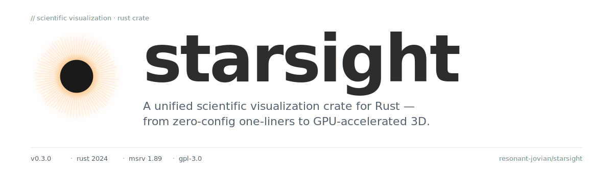

<sub>// funding</sub>

[](https://github.com/sponsors/resonant-jovian)
[](https://thanks.dev/u/gh/resonant-jovian)
[](https://orcid.org/0009-0008-1372-1727)

<sub>// package</sub>

[](https://crates.io/crates/starsight)
[](https://docs.rs/starsight)
[](https://crates.io/crates/starsight)
[](https://deps.rs/repo/github/resonant-jovian/starsight)

<sub>// license</sub>

[](https://www.gnu.org/licenses/gpl-3.0)
[](https://releases.rs/)
[](https://doc.rust-lang.org/edition-guide/)

<sub>// build</sub>

[](https://github.com/resonant-jovian/starsight/actions/workflows/ci.yml)
[](https://github.com/resonant-jovian/starsight/actions/workflows/gallery.yml)
[](https://github.com/resonant-jovian/starsight/actions/workflows/release.yml)
[](https://github.com/resonant-jovian/starsight/actions/workflows/snapshots.yml)
[](https://app.codecov.io/gh/resonant-jovian/starsight)

<sub>// community</sub>

[](https://github.com/resonant-jovian/starsight/stargazers)
[](https://github.com/resonant-jovian/starsight/graphs/contributors)
[](https://github.com/resonant-jovian/starsight/commits/main)
[](https://github.com/resonant-jovian/starsight/pulse)

</div>

> [!CAUTION]
> **starsight** is pre-release software. The API is unstable until `1.0.0` — pin an exact version in your `Cargo.toml` if you depend on it.

---

## Quickstart

> [!TIP]
> Confused by anything in the docs? File it at [`resonant-jovian/starsight/issues`](https://github.com/resonant-jovian/starsight/issues) — every "this was unclear" report makes the next reader's life easier.

```toml
[dependencies]
starsight = "0.3"
```

```rust
use starsight::prelude::*;

fn main() -> starsight::Result<()> {
    plot!(&[1.0, 2.0, 3.0, 4.0], &[10.0, 20.0, 15.0, 25.0]).save("chart.png")
}
```

The `plot!` macro forwards through `Figure::from_arrays`, which builds an 800×600 figure with a single `LineMark` and dispatches to the tiny-skia backend by file extension. The library is organized into seven layered crates re-exported from the `starsight` facade — see [Architecture](#architecture) below.

---

## Architecture

<p align="center">
  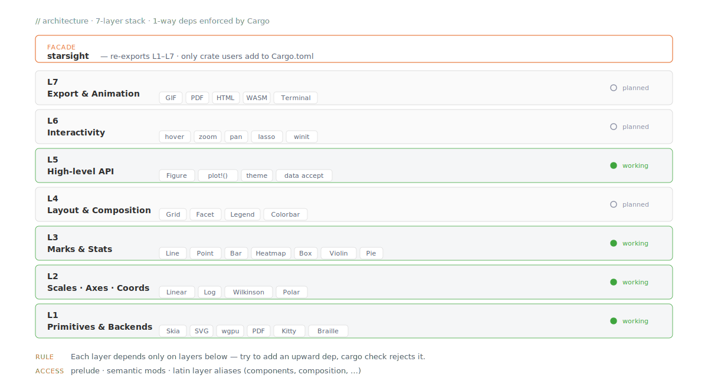
</p>

Each layer depends only on layers below it. The rule is enforced by `Cargo.toml`, not by convention — try to add an upward dependency and `cargo check` rejects it.

The facade crate (`starsight`) exposes three access patterns so users can pick the one that fits their style:

- **Prelude:** `use starsight::prelude::*;` for the common types (`Figure`, `LineMark`, `PointMark`, `Color`, `plot!`, ...).
- **Semantic modules:** `use starsight::marks::LineMark;`, `use starsight::backends::SkiaBackend;` — by category.
- **Latin layer aliases:** `use starsight::components::marks::LineMark;` — by layer (`background`, `modifiers`, `components`, `composition`, `common`, `interactivity`, `export`).

---

## Pipeline

<p align="center">
  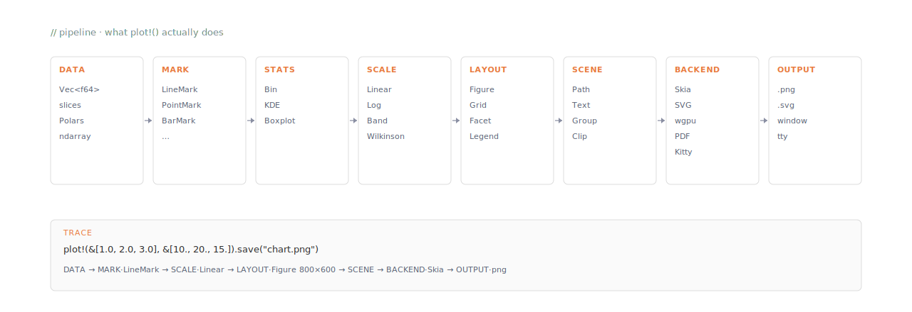
</p>

Every `plot!()` call walks the same eight stages. Inputs (slices, `Vec<f64>`, Polars DataFrames) become `Mark` configs, optionally pass through statistical transforms, then through scales (with Wilkinson tick selection), composed by `Figure` into a `SceneNode` tree, and rasterized by the backend selected via the file extension you save to.

---

## Coming from another language?

<sub>// 12 mappings · 5 libraries · ranked by familiarity</sub>

| You used | starsight | Key difference |
|---|---|---|
| `plt.plot(x, y)` | `plot!(x, y)` | No global state |
| `plt.scatter(x, y, c=c)` | `PointMark::new(x, y).color_by(&c)` | Builder pattern |
| `plt.bar(labels, vals)` | `BarMark::new(categories, values)` | Grammar of graphics |
| `plt.boxplot([a, b])` | `BoxPlotMark::new(vec![BoxPlotGroup::new("a", a), …])` | Per-group `BoxPlotGroup` carries its label |
| `sns.violinplot(data=df, x=…, y=…)` | `ViolinMark::new(groups).bandwidth(Bandwidth::Silverman)` | Bandwidth strategy is a builder, not magic |
| `plt.pie(values, labels=…)` | `PieMark::new(values, labels).show_percent()` | Add `.inner_radius(0.5)` for a donut |
| `mpl_finance.candlestick_ohlc` | `CandlestickMark::new(vec![Ohlc { … }, …])` | Inline `Ohlc` rows; no helper crate |
| `plt.savefig("out.png")` | `.save("out.png")?` | Returns `Result` |
| `plt.show()` | `.show()?` | Feature `interactive` |
| `sns.heatmap(data)` | `HeatmapMark::new(data)` | prismatica colormaps |
| `ggplot + geom_point()` | `Figure::new().add(PointMark)` | Builder, not `+` |
| `px.scatter(df, x="a")` | `plot!(df, x="a", y="b")` | Feature `polars` |

---

## Examples

<details>
<summary><b>Line chart with title and labels</b></summary>

```rust
use starsight::prelude::*;

fn main() -> starsight::Result<()> {
    Figure::new(800, 600)
        .title("Sales over time")
        .x_label("month")
        .y_label("revenue")
        .add(LineMark::new(
            vec![1.0, 2.0, 3.0, 4.0, 5.0],
            vec![3.4, 4.1, 5.7, 4.9, 6.3],
        ))
        .save("line.png")
}
```

✓ Available in 0.1.0
</details>

<details>
<summary><b>Two series with colors</b></summary>

```rust
use starsight::prelude::*;

fn main() -> starsight::Result<()> {
    Figure::new(800, 600)
        .add(
            LineMark::new(vec![0.0, 1.0, 2.0, 3.0], vec![0.0, 1.0, 2.0, 1.5])
                .color(Color::BLUE)
                .width(2.5),
        )
        .add(
            LineMark::new(vec![0.0, 1.0, 2.0, 3.0], vec![3.0, 2.0, 1.0, 0.5])
                .color(Color::RED)
                .width(2.5),
        )
        .save("two_series.png")
}
```

✓ Available in 0.1.0
</details>

<details>
<summary><b>Scatter with grouped color</b></summary>

```rust
use starsight::prelude::*;
use starsight::marks::PointMark;

fn main() -> starsight::Result<()> {
    let x = vec![1.0, 2.0, 3.0, 4.0, 5.0];
    let y = vec![2.0, 3.5, 1.8, 4.2, 3.1];
    let groups = vec!["a", "a", "b", "b", "c"];

    Figure::new(600, 400)
        .add(PointMark::new(x, y).color_by(&groups).radius(5.0))
        .save("scatter.png")
}
```

✓ Available in 0.2.0
</details>

<details>
<summary><b>SVG output</b></summary>

```rust
use starsight::prelude::*;

fn main() -> starsight::Result<()> {
    Figure::new(800, 600)
        .add(LineMark::new(
            vec![1.0, 2.0, 3.0, 4.0],
            vec![10.0, 20.0, 15.0, 25.0],
        ))
        .save("chart.svg") // dispatches to SvgBackend by extension
}
```

✓ Available in 0.1.0
</details>

<details>
<summary><b>Apply chromata theme + prismatica colormap</b></summary>

```rust
use starsight::prelude::*;
use starsight::marks::HeatmapMark;
use chromata::popular::gruvbox;
use prismatica::crameri::BATLOW;

fn main() -> starsight::Result<()> {
    let data: Vec<Vec<f64>> = (0..30)
        .map(|i| (0..30).map(|j| ((i * j) as f64).sin()).collect())
        .collect();

    Figure::new(600, 600)
        .theme(gruvbox::DARK_HARD.into())
        .add(HeatmapMark::new(data).colormap(BATLOW))
        .save("heatmap.png")
}
```

✓ Available in 0.2.0
</details>

### What it actually renders today

The full pipeline (Wilkinson ticks → axis rendering → cosmic-text labels → tiny-skia raster → PNG encoding) works end-to-end. Each card below is produced deterministically by `cargo xtask gallery` from the program in [`examples/`](https://github.com/resonant-jovian/starsight/tree/main/examples) — click an image to jump to its source. **All images are real outputs from `examples/` — nothing synthetic.**

#### Basics
<p align="center">
  <a href="https://github.com/resonant-jovian/starsight/blob/main/examples/basics/line_chart.rs">
    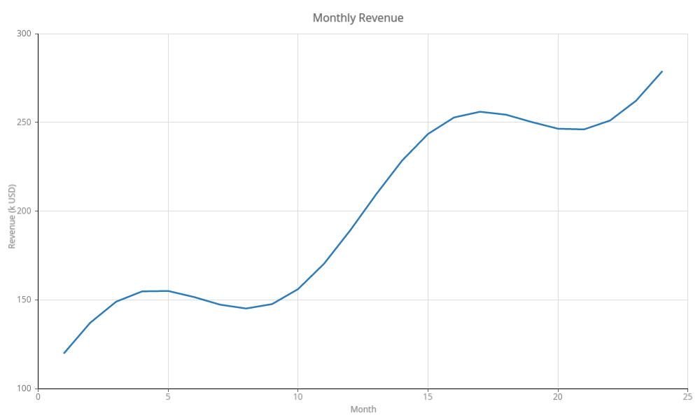
  </a>
  <a href="https://github.com/resonant-jovian/starsight/blob/main/examples/basics/scatter.rs">
    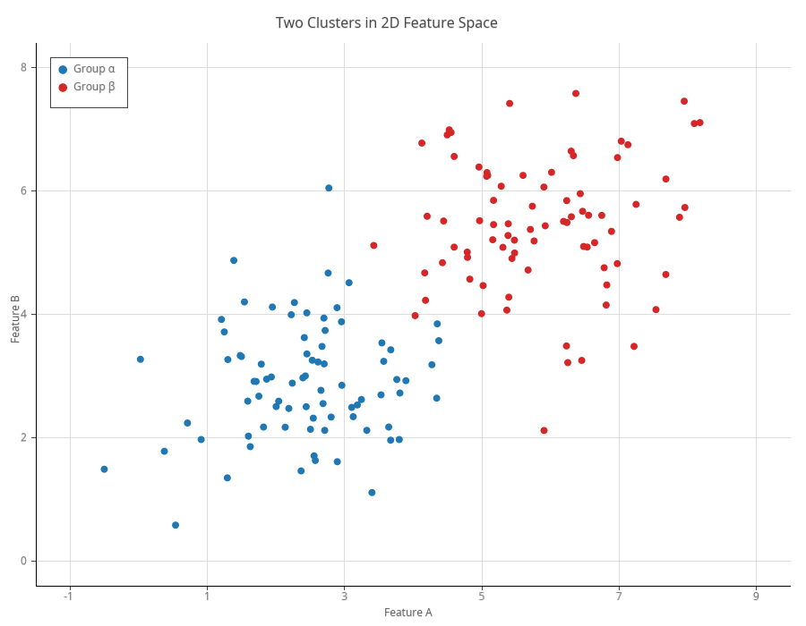
  </a>
  <a href="https://github.com/resonant-jovian/starsight/blob/main/examples/basics/bar_chart.rs">
    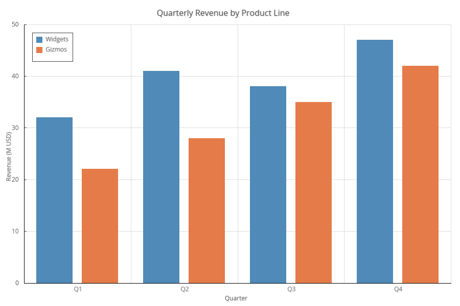
  </a>
  <a href="https://github.com/resonant-jovian/starsight/blob/main/examples/basics/histogram.rs">
    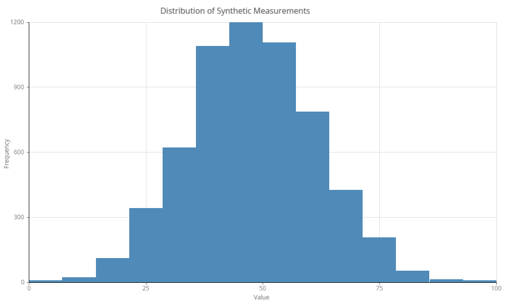
  </a>
  <a href="https://github.com/resonant-jovian/starsight/blob/main/examples/basics/bubble_scatter.rs">
    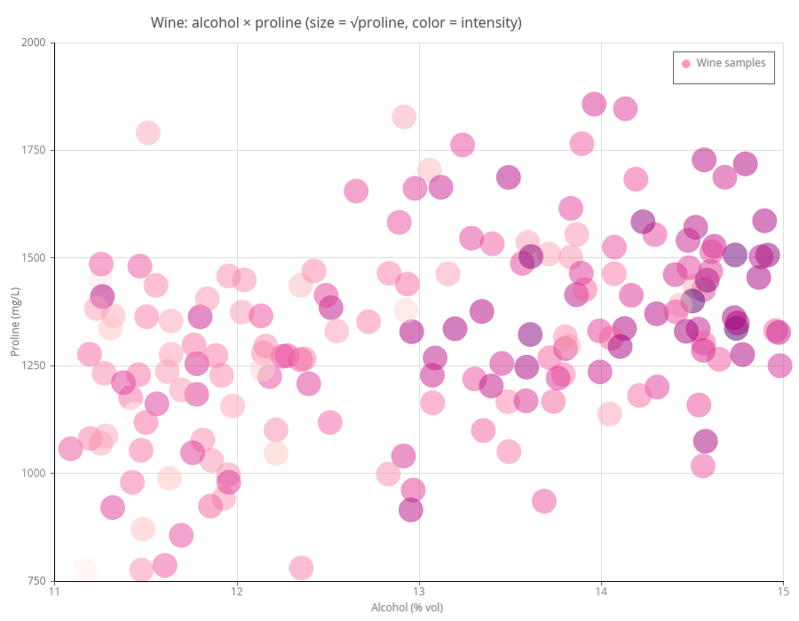
  </a>
  <a href="https://github.com/resonant-jovian/starsight/blob/main/examples/basics/heatmap.rs">
    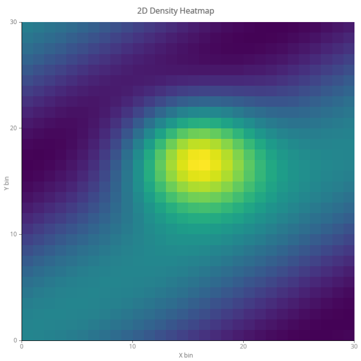
  </a>
</p>

#### Composition
<p align="center">
  <a href="https://github.com/resonant-jovian/starsight/blob/main/examples/composition/box_plot.rs">
    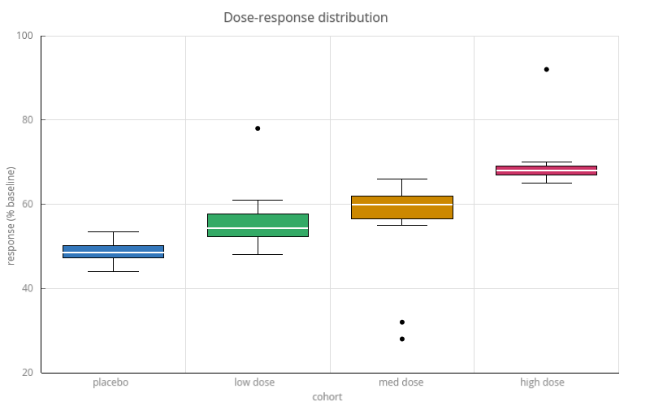
  </a>
  <a href="https://github.com/resonant-jovian/starsight/blob/main/examples/composition/violin.rs">
    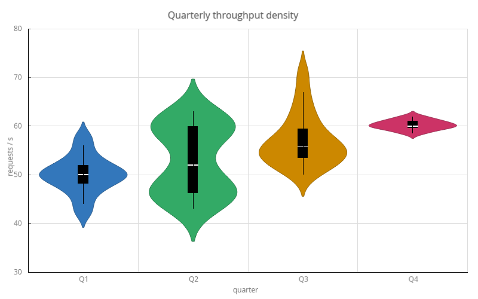
  </a>
  <a href="https://github.com/resonant-jovian/starsight/blob/main/examples/composition/pie.rs">
    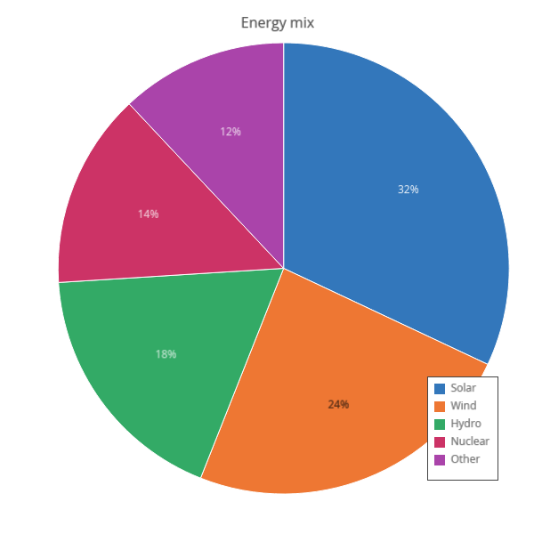
  </a>
  <a href="https://github.com/resonant-jovian/starsight/blob/main/examples/composition/donut.rs">
    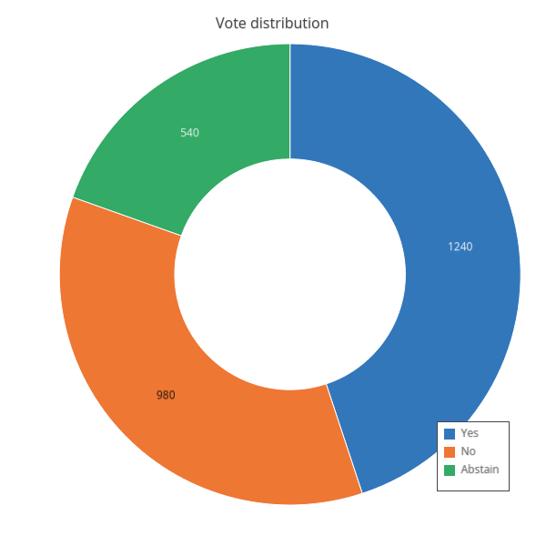
  </a>
  <a href="https://github.com/resonant-jovian/starsight/blob/main/examples/composition/waterfall_bar.rs">
    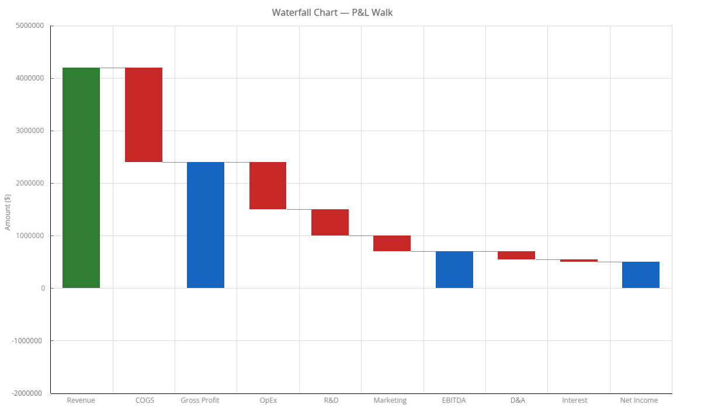
  </a>
</p>

#### Scientific & Data
<p align="center">
  <a href="https://github.com/resonant-jovian/starsight/blob/main/examples/scientific/candlestick.rs">
    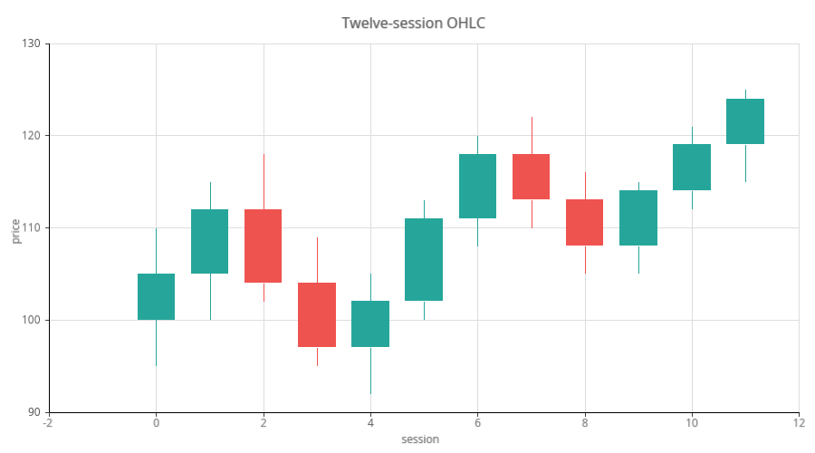
  </a>
  <a href="https://github.com/resonant-jovian/starsight/blob/main/examples/scientific/laser_plasma.rs">
    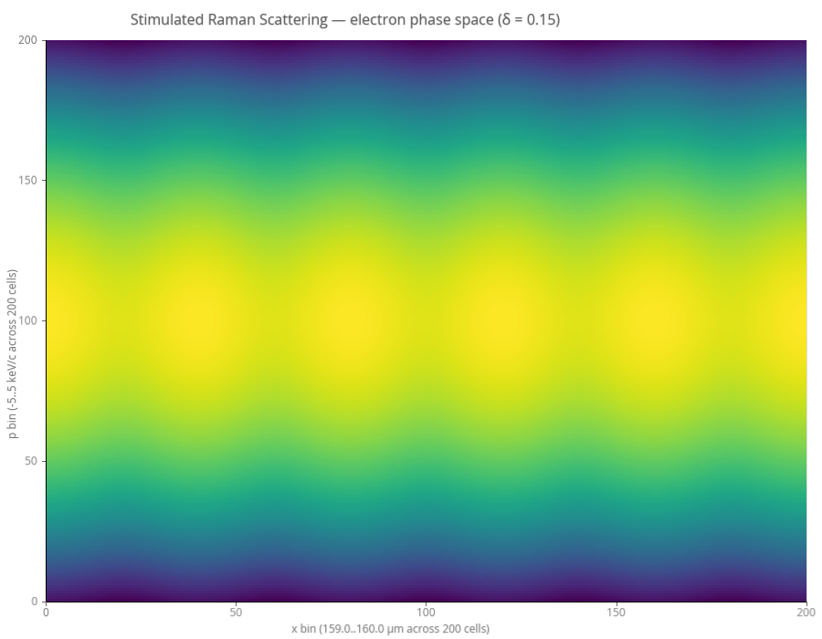
  </a>
  <a href="https://github.com/resonant-jovian/starsight/blob/main/examples/data/polars_integration.rs">
    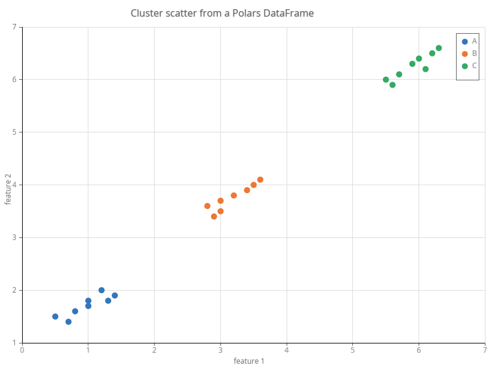
  </a>
</p>

> Note: snapshot tests in CI use the SVG backend (deterministic across operating systems and font setups).

---

## Features

<p align="center">
  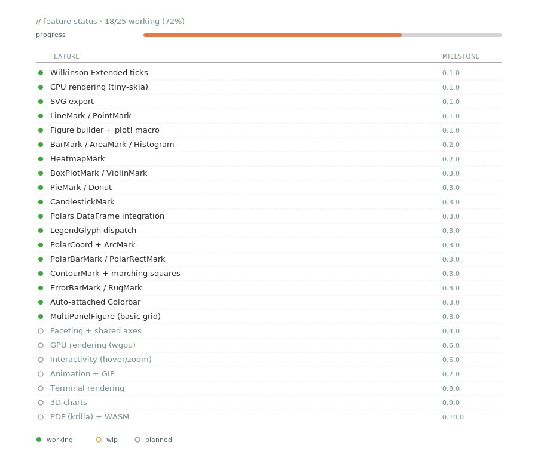
</p>

> [!IMPORTANT]
> Only rows marked **`working`** are usable today. `wip` rows compile but are pre-MVP. `planned` rows are stub files with `TODO` markers. Don't depend on either in production.

### Feature flags

> [!TIP]
> Feature flags toggle which sub-systems are compiled in, but most flags currently gate **planned** code. The `default` feature works today; the rest land per the [Roadmap](#roadmap). Listed in canonical order from `starsight/Cargo.toml`'s `[features]` block.

| Flag | Default | Description |
|------|---------|-------------|
| `default` | yes | CPU rendering via tiny-skia, SVG, PNG export |
| `full` | no | All features enabled |
| `minimal` | no | Core types only, no rendering |
| `science` | no | `stats` + `contour` + `3d` + `pdf` |
| `dashboard` | no | `interactive` + `gpu` + `polars` |
| `terminal` | no | TUI rendering via ratatui |
| `web` | no | WASM + WebGPU browser target |
| `gpu` | no | wgpu + vello GPU rendering |
| `interactive` | no | winit + egui interactive windows |
| `polars` | no | Polars DataFrame acceptance |
| `ndarray` | no | ndarray acceptance |
| `arrow` | no | Apache Arrow RecordBatch acceptance |
| `3d` | no | 3D chart types via nalgebra |
| `pdf` | no | PDF export via krilla |
| `stats` | no | Statistical transforms via statrs |
| `contour` | no | Isoline generation |
| `geo` | no | Geospatial chart types |
| `resvg` | no | SVG-to-PNG rasterization |

---

## Backends

<p align="center">
  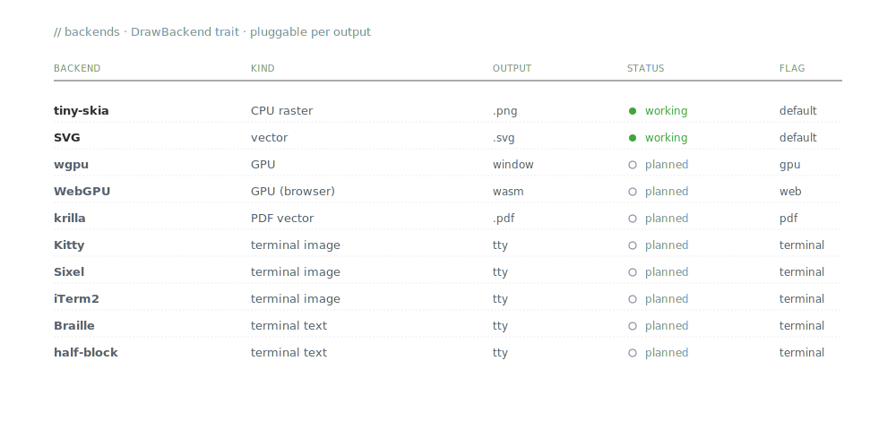
</p>

The `DrawBackend` trait is the only interface marks need to render. New backends slot in by implementing it — no other layer needs to change. The two `default`-feature backends (tiny-skia for raster PNG, SVG for vector) are what runs today; the rest land per the [Roadmap](#roadmap).

---

## Ecosystem

<p align="center">
  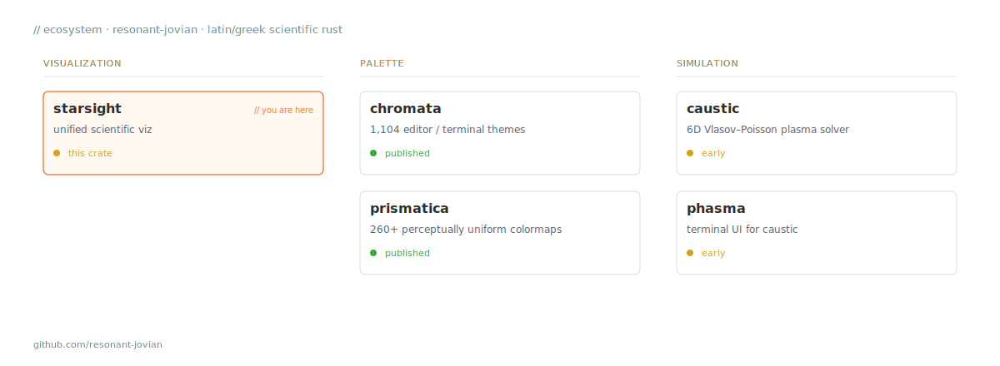
</p>

Part of the [resonant-jovian](https://github.com/resonant-jovian) ecosystem of Latin/Greek-named scientific Rust crates:

- [`starsight`](https://github.com/resonant-jovian/starsight) — Unified scientific visualization (this crate)
- [`chromata`](https://github.com/resonant-jovian/chromata) — 1,104 editor / terminal color themes as compile-time constants
- [`prismatica`](https://github.com/resonant-jovian/prismatica) — 260+ perceptually uniform colormaps as compile-time LUTs
- [`caustic`](https://github.com/resonant-jovian/caustic) — 6D Vlasov–Poisson solver for plasma physics
- [`phasma`](https://github.com/resonant-jovian/phasma) — Terminal UI for `caustic`

---

## vs. Siblings

<p align="center">
  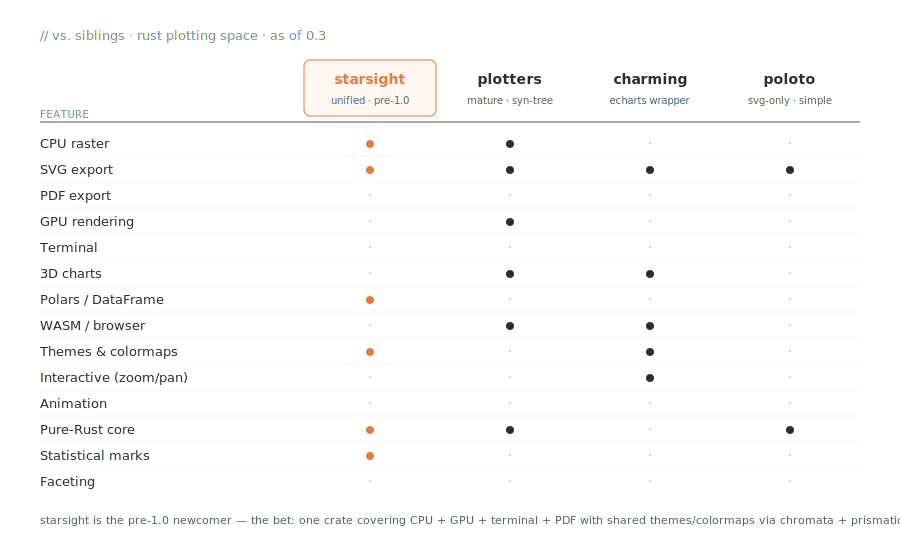
</p>

starsight is the pre-1.0 newcomer in this space. The bet: **one crate** covering CPU + GPU + terminal + PDF with a grammar-of-graphics builder and shared themes/colormaps via [`chromata`](https://github.com/resonant-jovian/chromata) + [`prismatica`](https://github.com/resonant-jovian/prismatica). Caveat: all four crates are alive and growing — the table is "as of starsight 0.3" and the gaps narrow as each ships.

---

## Roadmap

<p align="center">
  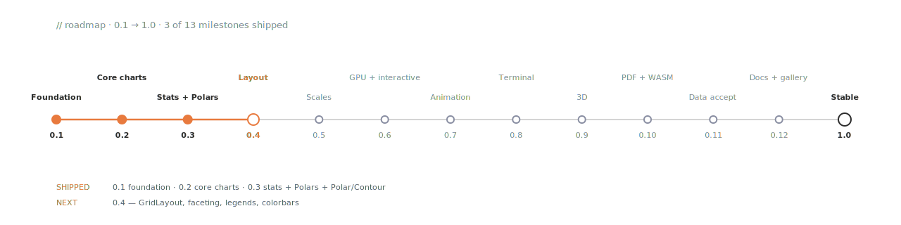
</p>

> [!TIP]
> Pin an exact version while the workspace evolves toward `1.0.0`. The high-level milestones are below; the full task-level roadmap with checkboxes lives in [`.spec/STARSIGHT.md`](.spec/STARSIGHT.md). See also: [CHANGELOG](CHANGELOG.md).

- [x] 0.1.0 Foundation — `DrawBackend`, tiny-skia + SVG, `LinearScale`, Wilkinson ticks, axes, `LineMark`/`PointMark`, `Figure`, `plot!`, snapshots
- [x] 0.2.0 Core charts — `BarMark` (vertical/horizontal/grouped/stacked), `AreaMark` (NaN-gap), `HistogramMark`, `HeatmapMark`
- [x] 0.3.0 Statistical charts + Polar + Contour + Grid + Polars — `BoxPlotMark`, `ViolinMark` + `Kde`, `PieMark`/donut, `CandlestickMark`, `LegendGlyph` dispatch, **`PolarCoord` + `ArcMark` (Nightingale / Gauge / Sunburst)**, **`PolarBarMark` (wind rose)**, **`PolarRectMark` (polar calendar)**, **`RadarMark` (spider chart)**, **`ContourMark` + marching-squares stat**, **`ErrorBarMark` + `RugMark`**, **auto-attached `Colorbar`**, **`MultiPanelFigure` (basic grid)**, Polars `DataFrame` integration (pulled forward from 0.11.0)
- [ ] 0.4.0 Layout — `FacetWrap`, shared axes across panels, `Colorbar`, polar-aware legend placement, contour filled bands
- [ ] 0.5.0 Scale infrastructure — `SymLogScale`, `DateTimeScale`, `BandScale` (`LogScale`/`SqrtScale`/`CategoricalScale` shipped in 0.3.0)
- [ ] 0.6.0 GPU + interactivity — wgpu native, hover / zoom / pan, winit event loop
- [ ] 0.7.0 Animation — timeline, frame recording, GIF
- [ ] 0.8.0 Terminal backend — Kitty / Sixel / iTerm2 / half-block / Braille
- [ ] 0.9.0 3D — `Surface3D`, `Scatter3D`, isosurface
- [ ] 0.10.0 Export + WASM — PDF (krilla), interactive HTML, WebGPU
- [ ] 0.11.0 Data acceptance — ndarray / Arrow (Polars landed early in 0.3.0)
- [ ] 0.12.0 Documentation, examples, gallery
- [ ] 1.0.0 Stable release

Full task-level roadmap with 338 checkboxes: [`.spec/STARSIGHT.md`](.spec/STARSIGHT.md).

---

## Hard rules

1. No JavaScript runtime dependencies.
2. No C/C++ system library dependencies in default features.
3. No `unsafe` in layers 3–7.
4. No runtime file I/O for core functionality (colormaps, themes, fonts are compile-time).
5. No `println!` or `eprintln!` in library code (`log` crate only).
6. No panics except in `.show()` when no display backend is available.
7. No nightly-only features required.
8. No `async` in the public API.

---

## Contribution

[Contribution guidelines for this project](CONTRIBUTING.md)

---

## Minimum supported Rust version

Rust edition 2024, targeting **stable Rust 1.89+** — enforced via the `rust-version` field in `[workspace.package]`. MSRV tracks the minimum version required by direct dependencies (currently `cosmic-text` at 1.89). The long-term policy is _latest stable minus two_, consistent with `wgpu` and `ratatui`; if the dependency floor lets us, we will bump MSRV in step with that policy.

---

## Citation

> [!IMPORTANT]
> If you use **starsight** in academic work, please cite it. [`CITATION.cff`](CITATION.cff) is the canonical source — GitHub renders a "Cite this repository" button from it automatically — and the BibTeX block below is the manual fallback.

```bibtex
@software{starsight,
  author       = {Sjögren, Albin},
  title        = {starsight: unified scientific visualization for Rust},
  url          = {https://github.com/resonant-jovian/starsight},
  license      = {GPL-3.0-only},
  orcid        = {0009-0008-1372-1727}
}
```

---

## Support

> [!NOTE]
> **starsight** is built in spare time and released under GPL-3.0-only. If it saves you work or earns you money, consider funding development so the next milestone lands sooner — via [GitHub Sponsors](https://github.com/sponsors/resonant-jovian) or [thanks.dev](https://thanks.dev/u/gh/resonant-jovian).

---

## License

> [!WARNING]
> **starsight** is licensed **GPL-3.0-only** and this is intentional. Any project that links against it must be GPL-3.0-compatible — copyleft propagates through derivative works. If you need a different licence for your use case, [reach out](mailto:albin@sjoegren.se) before integrating.

This project is licensed under the [GNU General Public License v3.0](LICENSE).
